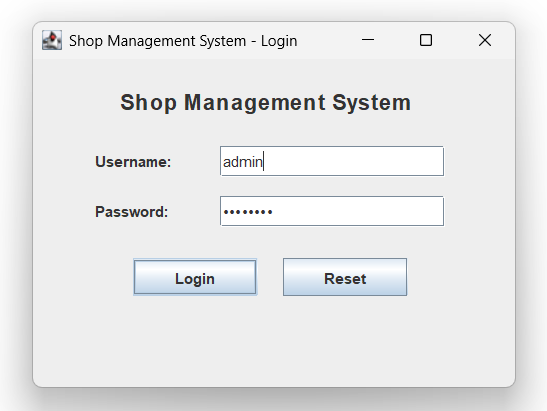
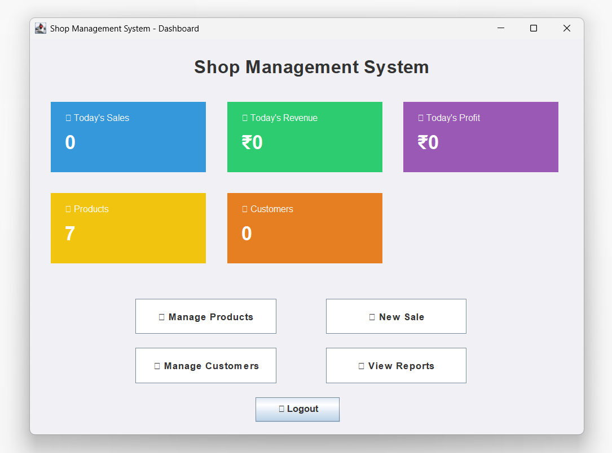
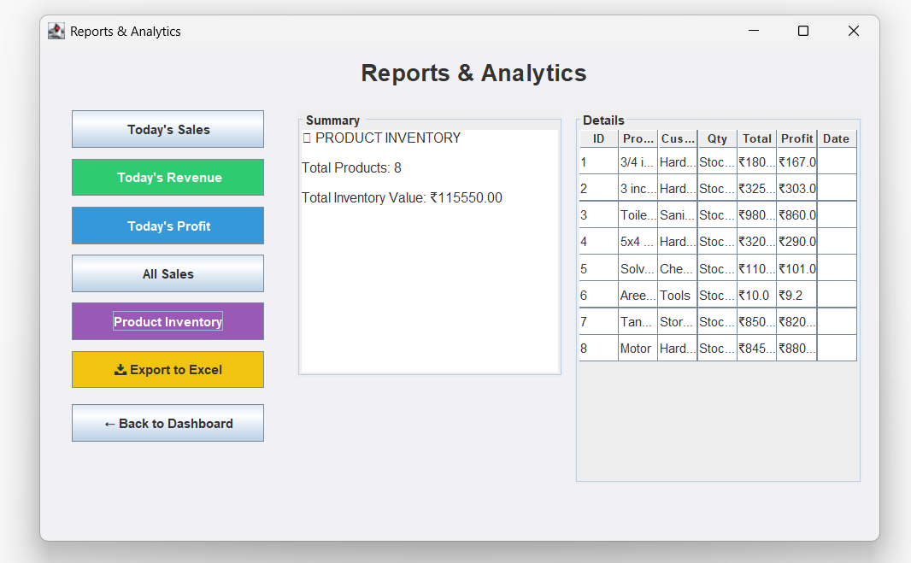
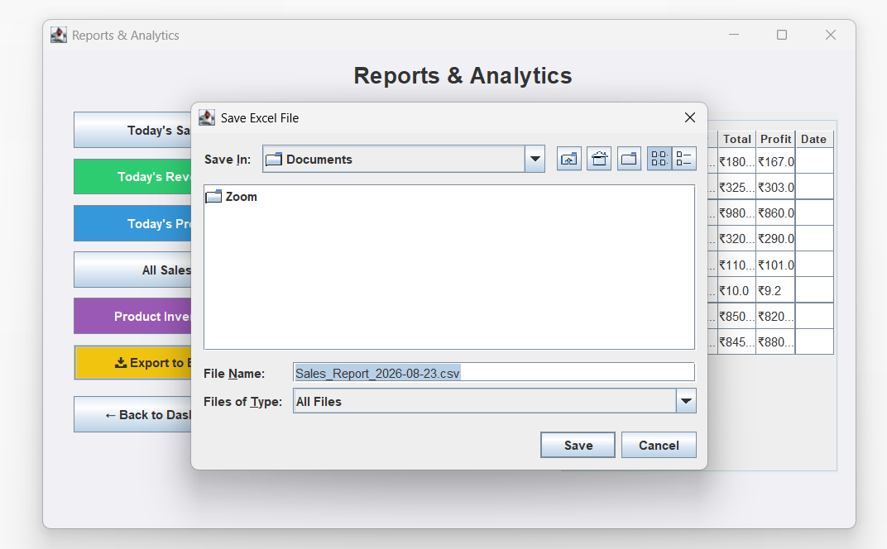
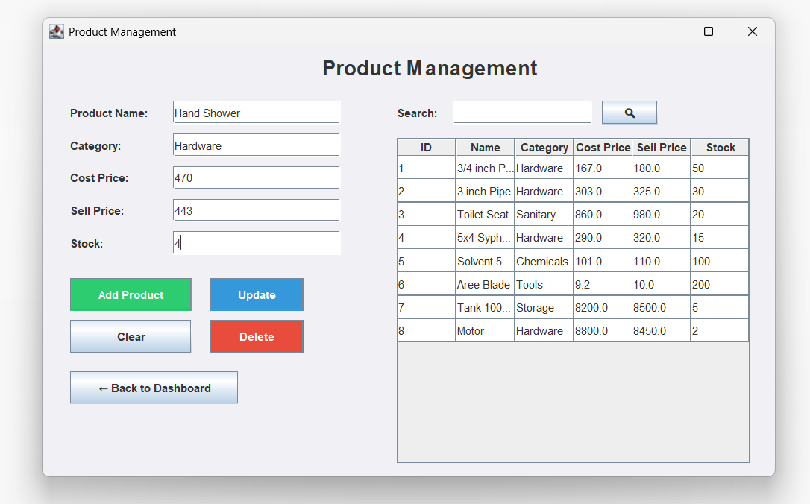
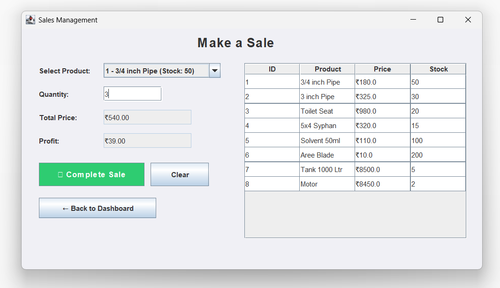
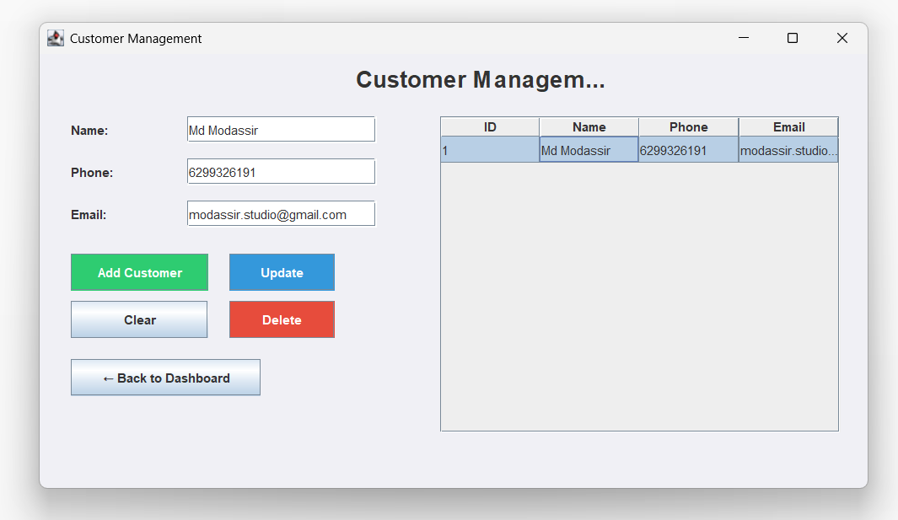
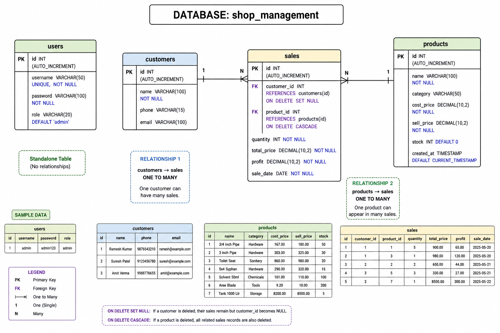

# Shop Management System

A full-stack desktop application for managing shop sales, inventory, customers, and reports. Built to solve real small-business needs.

## 🎯 About This Project

Small shop owners often rely on paper registers or scattered spreadsheets. This application replaces that with a single desktop system for managing products, customers, sales, and stock — with automatic profit calculation and Excel export for reporting.

**Built independently to solve real shop management needs.**

## 🛠️ Technologies

| Technology | Purpose |
|------------|---------|
| Java (Swing) | Desktop UI |
| MySQL | Database |
| JDBC | Database connectivity |
| DAO Pattern | Clean code architecture |

## ✨ Features

- 🔐 Admin login with authentication
- 📦 Product management (CRUD + search)
- 👥 Customer management
- 💰 Sales entry with auto-profit calculation
- 📊 Real-time stock updates
- 📈 Reports (Daily / All / Revenue / Profit)
- 📥 Excel export for external analysis
- 🖥️ Dashboard with live KPI cards

## 🗄️ Database Tables

- `users` — admin authentication
- `products` — product catalog with price & stock
- `customers` — customer records
- `sales` — transaction history with profit tracking

## 📸 Screenshots

### Login & Dashboard
| Login | Dashboard |
|:--:|:--:|
|  |  |

### Reports & Export
| Reports | Export to Excel |
|:--:|:--:|
|  |  |

### Products, Sales & Customers
| Products | Sales | Customer |
|:--:|:--:|:--:|
|  |  |  |

## 📐 ER Diagram

## 🚀 Setup Instructions

1. Run `schema.sql` in MySQL Workbench
2. Update `DBConnection.java` with your MySQL credentials
3. Run `LoginFrame.java` to start the application

## 📚 What I Learned

- Building a full-stack desktop app from scratch
- Designing a normalized database schema with relationships
- Implementing the DAO pattern for clean separation of concerns
- Handling real-world scenarios like stock updates and profit calculation
- Exporting data to Excel for further analysis

## 👤 Author

**Md Modassir**
- GitHub: [@modassirstudio](https://github.com/modassirstudio)
- Project: [Shop Management System](https://github.com/modassirstudio/Shop-Management-System)
